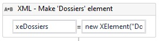
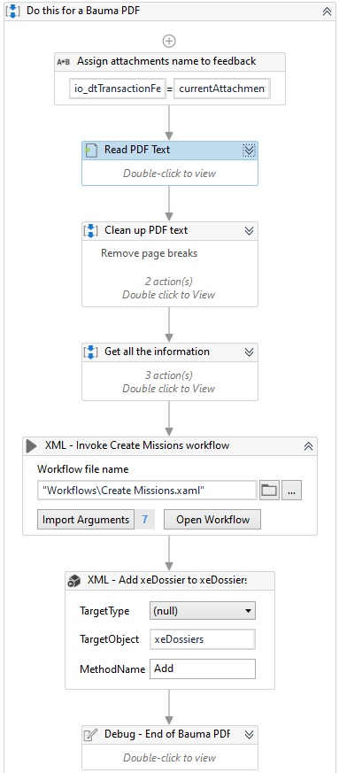
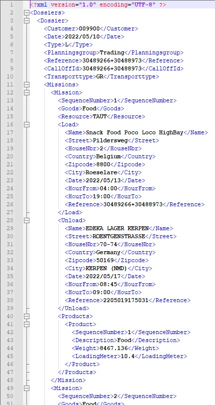
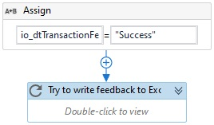

# GroupGTS - behandelen transport documentatie
## Omschrijving

Dit project is een UiPath robot dat bepaalde mails uitleest die PDFs of Excel bestanden bezitten. In deze bestanden staat gestructureerde data die uitgelezen wordt om later te verwerken in een XML bestand dat zo verder buiten het proces van de robot gebruikt word.

## Waarneming

Dit project is tot stand gebracht met gebruikmakend van UiPath en het UiPath Robotic Enterprise Framework. Meer informatie over het [Robotic Enterprise Framework](#robotic-enterprise-framework) kan u vinden onderaan de pagina.

- [GroupGTS - behandelen transport documentatie](#groupgts---behandelen-transport-documentatie)
  - [Omschrijving](#omschrijving)
  - [Waarneming](#waarneming)
  - [Uitvoering](#uitvoering)
    - [Initializering](#initializering)
      - [Aanmaken folders](#aanmaken-folders)
      - [Emails lezen](#emails-lezen)
      - [Verwijderen van folders vorig proces](#verwijderen-van-folders-vorig-proces)
    - [Toewijzen transactie item](#toewijzen-transactie-item)
    - [Proces transactie item](#proces-transactie-item)
      - [Eerste run](#eerste-run)
      - [Aanmaken data tabellen](#aanmaken-data-tabellen)
      - [Nakijken van klant](#nakijken-van-klant)
      - [Algemeen voor cliënten](#algemeen-voor-cliënten)
      - [Cliënt 1](#cliënt-1)
      - [Cliënt 2](#cliënt-2)
      - [Cliënt 3](#cliënt-3)
      - [Afhandeling transactie item](#afhandeling-transactie-item)
    - [Einde van proces](#einde-van-proces)
- [Robotic Enterprise Framework](#robotic-enterprise-framework)
    - [Documentation is included in the Documentation folder](#documentation-is-included-in-the-documentation-folder)
    - [REFrameWork Template](#reframework-template)
    - [How It Works](#how-it-works)
    - [For New Project](#for-new-project)

## Uitvoering

Hieronder zie je de workflow van het proces. Deze workflow is het Robotic Enterprise Framework

### Initializering

#### Aanmaken folders

In het begin van het proces wordt er een uniek nummer gemaakt. Dit uniek nummer bestaat uit de combinatie van de start datum en start tijd tot op de second van het proces. Door dit te doen kunnen er bestanden en folders aangemaakt worden om voor huidige proces en kunnen nadien deze bestanden en folder bekeken worden.

In het begin zal er ook nagekeken worden of de feedback folder al bestaat. In deze fodler zal elke feedback van elk proces worden opgeslagen. Het indetificeren van een proces wordt gedaan met gebruikmakende van het unieke nummer.

#### Emails lezen

De workflow voor lezen van emails staat in een retry scope activiteit. Dit zorgt ervoor als er een probleem is tijdens het lezen van de emails zal het proces opnieuw proberen om deze workflow uit te voeren. Het aantal keren van herproberen kan meegegeven worden. Hier wordt er maximaal drie keer opnieuw geprobeert.

Vooraleer de emails worden gelezen wordt er een lege lijst aangemaakt voor transactie items. Deze transactie items zijn de emails die behandeld moeten worden.

Verder in het proces wordt in de achtergrond de Outlook geopend. Als het gebruikte email adres nog nooit toegang heeft gegeven aan het project om Outlook te gebruiken wordt er gevraagt om in te loggen. Daarna gebeuren de onderstaande activiteiten op de achtergrond. Tijdens deze activiteiten leest de robot emails in en kijkt na of deze bepaalde filters bezitten. Als er een email is met de jusite filter wordt deze in de lijst gestoken met te behandelende emails.

Na het inlezen van de emails wordt de lijst met de te behandelende emails teruggegeven naar waar de workflow is opgeroepen. Namelijk in het initializerings proces.

#### Verwijderen van folders vorig proces

Als laatste stap van de initializering wordt de folder waar de bestanden van emails worden gedownload verwijdert. Door dit te doen kan het proces met een propere werkplek starten. Deze bestanden worden verwijderd omdat na het proces van de robot deze bestanden niet meer van toepassing zijn. Het wordt hier opgeroepen omdat het mogelijk is dat het vorige proces gecrasht is en de bestanden niet had kunnen verwijderen.

### Toewijzen transactie item

Bij het afhandelen van voorgaande transactie item wordt er een gecontroleerde of er nog een nieuw transactie item is. Als dit is wordt het nieuwe transactie item, of email, doorgegeven naar het volgende proces. Als er geen nieuw transactie item is wordt er een leeg item meegegeven zodat het proces weet dat het zichzelf mag beëindigen.

### Proces transactie item

Nadat er een transactie item is meegegeven wordt dit behandeld in het process workflow.

#### Eerste run

Als dit transactie item het eerste is worden er bepaalde variabelen en bestanden aangemaakt. Zo wordt er een data tabel aangemaakt waar de feedback van alle transactie items instaat. In het begin staat elk transactie item status op een lege status. Zo kan er voor de klant geen verwarring opduiken.

Daarna wordt deze data tabel weggeschreven in een nieuw Excel bestand dat als naam de unieke run nummer krijgt. Als de eerste rij van de data tabel wordt weggeschreven krijgt de tabel nog een stijl toegewezen in het Excel bestand.

Voorbeeld van de start van een feedback tabel.

#### Aanmaken data tabellen
In het begin van het proces worden data tabellen aangemaakt. Deze data tabellen worden later aangevult met benodige data die in een XML bestand terug moeten komen.
Zo worden volgende data tabellen aangemaakt:
* Dossier
  * De dossier data tabel bevat cliënt nummer, datum aanmaak van dossier, plannigsgroup, etc.
* Mission
  * Bevat informatie over wat soort goederen er worden getransporteerd
* Load
  * Deze data tabel bevat de laad locatie van de te leveren goederen.
  * Het bevat ook laad tijd en extra informatie over het laden.
* Unload
  * Hier worden al de los locatie opgeslagen
  * Ook wordt zoals bij het laden de tijd opgeslagen en extra informatie over het lossen.
* Products
  * Hier wordt meegegeven wat soort goederen de cliënt wilt transporteren en meer gedetaileerde informatie over de lading.

#### Nakijken van klant

Per transactie item moet er nagekeken worden van welke klant de email komt. Dit is een belangerijk onderdeel in het proces omdat elke klant zijn eigen soort layout heeft in bijlages over transport. Hier wordt de cliënt naam en cliënt nummer opgeslagen in een variabelen om zo deze verder te gebruiken in het proces.

Nadat de klant is gevonden wordt er een folder aangemaakt waar alle bijlage bij deze email zal worden opgeslagen. Daarna zal alle bestanden met een bepaalde extensie gedownload worden en in deze aangemaakte map gestoken worden. Ook word de cliënt naam en nummer toegevoegt aan de feedback data tabel op de huidige rij. Uiteindelijk wordt er ook nog een hoofdfolder voor XML bestanden van deze cliënt in deze run aangemaakt.

Vooraleer de data uit de bestanden wordt gehaald gebeurt er een update in de feedback data tabel waardoor in de huidige rij de status verandert wordt door 'Processing...' en wordt dit weggeschreven in het feedback Excel bestand. Dit geeft aan voor de klant, in het Excel bestand, dat het process bezig is.

Door de cliënt nummer te weten weet de robot hoe het bijlage van een email moet aanpakken. Dit is voor elke cliënt anders want, zoals eerder vermeld, heeft elke cliënt zijn eigen layout voor documentatie van transport.

#### Algemeen voor cliënten

Elke cliënt heeft in de workflow ongeveer dezelfde layout. Zo is het makkelijker voor later om andere cliënten toe te voegen. De PDF bestanden worden uitgelezen door gebruikmakend van een PDF tekst lezer en de bonodigede data wordt uit deze tekst gehaald met gehulp van regular expression. Voor Excel bestanden kan de robot gewoon cellen lezen uit een gestructureerde tabel.
Nadat de informatie is uitgelezen wordt deze doorgevoerd aan een workflow waar het wordt omgevormd in een XML. Deze XML wordt daarna opgeslagen met een gepaste XML header.

#### Cliënt 1

De eerste cliënt maakt gebruik van een PDF bestand om transport te documenteren. Elk bestand heeft basis informatie over de cliënt, ophaal informatie over het transport en enkele los lokaties (1 of meerdere).

Bij het uitlezen van de PDF tekst worden de footer en headers van de volgende pagina verwijderd. Door dit te doen is er tussen de te lezen data geen onnodige tekst te vinden. Dit wordt, zoals voorgaande vermeld, verwezelijkt door gebruikmakend van regular expression.

De main informatie wordt uitgelezen en wordt ogeslagen in de dossier data tabel. Deze data tabel bevat de informatie die het dossier XML element nodig heeft in het proces.
Deze informatie bevat:
* Dossier type
* Transport type
* Datum
* Referencie nummmer(s)
* Planningsgroep

Bij het aanmaken van de mission data tabel worden er een aantal vaste variabelen meegegeven die aanwezig moeten zijn in eht mission XML element.

Nadat de main informatie is uitgelezen worden de benodigde adressen uitgelezen en in hun aangegeven data tabel gestoken. Het uitlezen van het laad adres geeft maar één resultaat per PDF. 

Bij het uitlezen van de los adressen kan het zijn dat er maar één resultaat is maar mogelijks meerdere. Deze worden opgesplits bij het voorkomende woord 'Déchargement'.

De data tabellen Dossier, laden en lossen worden meegegeven naar een workflow waar alle benodigde informatie wordt omzet in een geheel dossier XML element. Dit dossier XML element wordt daarna toegevoegd aan het dossiers XML element. Nadat alle bijlage uit de email zijn uitgelezen wordt het dossiers XML element opgeslagen in een XML bestand.

#### Cliënt 2

De tweede cliënt maakt ook gebruik van een PDF bestand om transport te documenteren. Elk bestand heeft basis informatie over de cliënt, ophaal informatie over het transport en enkele los lokaties (1 of meerdere).

Zoals bij de eerste cliënt worden de footers gevolgd door een header verwijderd uit de geëxtraheerde tekst. Dit gebeurt door gebruikmakend van regular expressions.

Vervolgens word de main informatie uitgelezen ui de tekst om zo de dossier data tabel in te vullen. Daarna word de mission data tabel ingevuld met vaste variabelen. Deze variabelen bevatten inforamtie over het transport. Net zoals bij cliënt 1.

Nadat de main infomatie uitgelezen is worden de laad en los adressen uitgelezen. Voor het laden is zoals bij cliënt één maar één adres meegegeven in het begin van het document. Voor het lossen kan er meer dan één adres zijn. Deze los punten zijn opgesplits door het woord DELIVERY in het begin van de zin. Zo weet de robot dat er meerdere los punten zijn.

De data tabellen Dossier, laden en lossen worden meegegeven naar een workflow waar alle benodigde informatie wordt omzet in een geheel dossier XML element. Dit dossier XML element wordt daarna toegevoegd aan het dossiers XML element. Nadat alle bijlage uit de email zijn uitgelezen wordt het dossiers XML element opgeslagen in een XML bestand.

#### Cliënt 3

De tweede cliënt maakt gebruik van een Excel bestand om transport te documenteren. Elk bestand heeft basis informatie over de cliënt, ophaal informatie over het transport en enkele los lokaties (1 of meerdere).

Bij het uitlezen van de spread sheet worden er twee verschillende tabellen met elkaar gemixt. Dit kunnen we voorkomen door uit deze uitgelezen tabel na te kijken of de eerste kolom een lege waarde heeft of niet. Als deze eerste kolom in de gehandelde rij een lege waarde heeft wordt deze niet toegevoegd aan de nieuw data tabel.

Zoals bij de voorgaande klanten wordt de informatie uit het meegegeven bestand gehaald. de flow is hetzelfde, maar de data wordt uit een data tabel gehaald in plaats van een tekst.

Met al de benodigde data tabellen gevuld me benodigde informatie worden deze in een workflow meegegeven om zo het dossiers XML element bij aan te vullen.

Uiteindelijk na het lezen van alle bijlage van de email wordt het dossiers XML element opgeslagen in een XML bestand op de juiste lokatie.

#### Afhandeling transactie item

Nadat het transactie item goed is afgehandeld wordt in de feedback tabel de status waarde van het huidige transactie item verandert naar 'Success'. Deze data tabel wordt dan nogmaals weggeschreven naar het feedback Excel bestand.

### Einde van proces

Als er uiteindelijk geen transactie item die nog behandeld moeten zijn zal het proces zichzelf afronden. Hier worden de geopende applicatie doorheen het proces gesloten zodat de klant dit niet zelf hoeft te doen. Het feedback Excel bestand zal aanwezig zijn op de lokatie waar de feedback bestanden worden opgeslagen.

---
# Robotic Enterprise Framework
### Documentation is included in the Documentation folder ###

[REFrameWork Documentation](https://github.com/UiPath/ReFrameWork/blob/master/Documentation/REFramework%20documentation.pdf)

### REFrameWork Template ###
**Robotic Enterprise Framework**

* Built on top of *Transactional Business Process* template
* Uses *State Machine* layout for the phases of automation project
* Offers high level logging, exception handling and recovery
* Keeps external settings in *Config.xlsx* file and Orchestrator assets
* Pulls credentials from Orchestrator assets and *Windows Credential Manager*
* Gets transaction data from Orchestrator queue and updates back status
* Takes screenshots in case of system exceptions

### How It Works ###

1. **INITIALIZE PROCESS**
 + ./Framework/*InitiAllSettings* - Load configuration data from Config.xlsx file and from assets
 + ./Framework/*GetAppCredential* - Retrieve credentials from Orchestrator assets or local Windows Credential Manager
 + ./Framework/*InitiAllApplications* - Open and login to applications used throughout the process

2. **GET TRANSACTION DATA**
 + ./Framework/*GetTransactionData* - Fetches transactions from an Orchestrator queue defined by Config("OrchestratorQueueName") or any other configured data source

3. **PROCESS TRANSACTION**
 + *Process* - Process trasaction and invoke other workflows related to the process being automated 
 + ./Framework/*SetTransactionStatus* - Updates the status of the processed transaction (Orchestrator transactions by default): Success, Business Rule Exception or System Exception

4. **END PROCESS**
 + ./Framework/*CloseAllApplications* - Logs out and closes applications used throughout the process

### For New Project ###

1. Check the Config.xlsx file and add/customize any required fields and values
2. Implement InitiAllApplications.xaml and CloseAllApplicatoins.xaml workflows, linking them in the Config.xlsx fields
3. Implement GetTransactionData.xaml and SetTransactionStatus.xaml according to the transaction type being used (Orchestrator queues by default)
4. Implement Process.xaml workflow and invoke other workflows related to the process being automated
