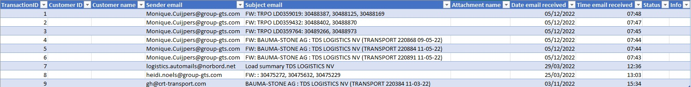

# **GroupGTS - behandelen transport**
## **Descriptie**

Dit project is een UiPath robot dat bepaalde mails uitleest die PDFs of Excel bestanden bezitten. In deze bestanden staat gestructureerde data die uitgelezen wordt om later te verwerken in een XML bestand dat zo verder buiten het proces van de robot gebruikt word.  

## **Waarneming**

Dit project is tot stand gebracht met gebruikmakend van UiPath en het UiPath Robotic Enterprise Framework. Meer informatie over het [Robotic Enterprise Framework](#robotic-enterprise-framework) kan u vinden onderaan de pagina.

* [Initializering](#initializering)
  1. [Aanmaken folders](#stap-1---aanmaken-folders)
  1. [Emails lezen](#stap-2---emails-lezen)
  1. [Verwijderen van folders vorig proces](#stap-3---verwijderen-van-folders-vorig-proces)
* [Toewijzen transactie item](#toewijzen-transactie-item)

## **Uitvoering**

Hieronder zie je de workflow van het proces. Deze workflow is het Robotic Enterprise Framework

### **Initializering**

#### **Stap 1 - Aanmaken folders**

In het begin van het proces wordt er een uniek nummer gemaakt. Dit uniek nummer bestaat uit de combinatie van de start datum en start tijd tot op de second van het proces. Door dit te doen kunnen er bestanden en folders aangemaakt worden om voor huidige proces en kunnen nadien deze bestanden en folder bekeken worden.

In het begin zal er ook nagekeken worden of de feedback folder al bestaat. In deze fodler zal elke feedback van elk proces worden opgeslagen. Het indetificeren van een proces wordt gedaan met gebruikmakende van het unieke nummer.

#### **Stap 2 - Emails lezen**

De workflow voor lezen van emails staat in een retry scope activiteit. Dit zorgt ervoor als er een probleem is tijdens het lezen van de emails zal het proces opnieuw proberen om deze workflow uit te voeren. Het aantal keren van herproberen kan meegegeven worden. Hier wordt er maximaal drie keer opnieuw geprobeert.

Vooraleer de emails worden gelezen wordt er een lege lijst aangemaakt voor transactie items. Deze transactie items zijn de emails die behandeld moeten worden.

Verder in het proces wordt in de achtergrond de Outlook geopend. Als het gebruikte email adres nog nooit toegang heeft gegeven aan het project om Outlook te gebruiken wordt er gevraagt om in te loggen. Daarna gebeuren de onderstaande activiteiten op de achtergrond. Tijdens deze activiteiten leest de robot emails in en kijkt na of deze bepaalde filters bezitten. Als er een email is met de jusite filter wordt deze in de lijst gestoken met te behandelende emails.

Na het inlezen van de emails wordt de lijst met de te behandelende emails teruggegeven naar waar de workflow is opgeroepen. Namelijk in het initializerings proces.

#### **Stap 3 - Verwijderen van folders vorig proces**

Als laatste stap van de initializering wordt de folder waar de bestanden van emails worden gedownload verwijdert. Door dit te doen kan het proces met een propere werkplek starten. Deze bestanden worden verwijderd omdat na het proces van de robot deze bestanden niet meer van toepassing zijn. Het wordt hier opgeroepen omdat het mogelijk is dat het vorige proces gecrasht is en de bestanden niet had kunnen verwijderen.

### **Toewijzen transactie item**

Bij het afhandelen van voorgaande transactie item wordt er een gecontroleerde of er nog een nieuw transactie item is. Als dit is wordt het nieuwe transactie item, of email, doorgegeven naar het volgende proces. Als er geen nieuw transactie item is wordt er een leeg item meegegeven zodat het proces weet dat het zichzelf mag beëindigen.

### **Proces transactie item**

Nadat er een transactie item is meegegeven wordt dit behandeld in het process workflow.

#### **Stap 1 - Eerste run**

Als dit transactie item het eerste is worden er bepaalde variabelen en bestanden aangemaakt. Zo wordt er een data tabel aangemaakt waar de feedback van alle transactie items instaat. In het begin staat elk transactie item status op een lege status. Zo kan er voor de klant geen verwarring opduiken.

Daarna wordt deze data tabel weggeschreven in een nieuw Excel bestand dat als naam de unieke run nummer krijgt. Als de eerste rij van de data tabel wordt weggeschreven krijgt de tabel nog een stijl toegewezen in het Excel bestand.

Voorbeeld van de start van een feedback tabel.

#### **Stap 2 - Normaal proces**

##### **Aanmaken data tabellen**
In het begin van het proces worden data tabellen aangemaakt. Deze data tabellen worden later aangevult met benodige data die in een XML bestand terug moeten komen.
Zo worden volgende data tabellen aangemaakt:
* Dossier
  * De dossier data tabel bevat client nummer, datum aanmaak van dossier, plannigsgroup, etc.
* Mission
  * Bevat informatie over wat soort goederen er worden getransporteerd
* Load
  * Deze data tabel bevat de laad locatie van de te leveren goederen.
  * Het bevat ook laad tijd en extra informatie over het laden.
* Unload
  * Hier worden al de los locatie opgeslagen
  * Ook wordt zoals bij het laden de tijd opgeslagen en extra informatie over het lossen.
* Products
  * Hier wordt meegegeven wat soort goederen de client wilt transporteren en meer gedetaileerde informatie over de lading.

##### **Nakijken van klant**

Per transactie item moet er nagekeken worden van welke klant de email komt. Dit is een belangerijk onderdeel in het proces omdat elke klant zijn eigen soort layout heeft in bijlages over transport. Hier wordt de client naam en client nummer opgeslagen in een variabelen om zo deze verder te gebruiken in het proces.

Nadat de klant is gevonden wordt er een folder aangemaakt waar alle bijlage bij deze email zal worden opgeslagen. Daarna zal alle bestanden met een bepaalde extensie gedownload worden en in deze aangemaakte map gestoken worden. Ook word de client naam en nummer toegevoegt aan de feedback data tabel op de huidige rij. Uiteindelijk wordt er ook nog een hoofdfolder voor XML bestanden van deze client in deze run aangemaakt.

Vooraleer de data uit de bestanden wordt gehaald gebeurt er een update in de feedback data tabel waardoor in de huidige rij de status verandert wordt door 'Processing...' en wordt dit weggeschreven in het feedback Excel bestand. Dit geeft aan voor de klant, in het Excel bestand, dat het process bezig is.

Door de client nummer te weten weet de robot hoe het bijlage van een email moet aanpakken. Dit is voor elke client anders want, zoals eerder vermeld, heeft elke client zijn eigen layout voor documentatie van transport.

##### **Klant 1**

## **Robotic Enterprise Framework**
### Documentation is included in the Documentation folder ###

[REFrameWork Documentation](https://github.com/UiPath/ReFrameWork/blob/master/Documentation/REFramework%20documentation.pdf)

### REFrameWork Template ###
**Robotic Enterprise Framework**

* Built on top of *Transactional Business Process* template
* Uses *State Machine* layout for the phases of automation project
* Offers high level logging, exception handling and recovery
* Keeps external settings in *Config.xlsx* file and Orchestrator assets
* Pulls credentials from Orchestrator assets and *Windows Credential Manager*
* Gets transaction data from Orchestrator queue and updates back status
* Takes screenshots in case of system exceptions

### How It Works ###

1. **INITIALIZE PROCESS**
 + ./Framework/*InitiAllSettings* - Load configuration data from Config.xlsx file and from assets
 + ./Framework/*GetAppCredential* - Retrieve credentials from Orchestrator assets or local Windows Credential Manager
 + ./Framework/*InitiAllApplications* - Open and login to applications used throughout the process

2. **GET TRANSACTION DATA**
 + ./Framework/*GetTransactionData* - Fetches transactions from an Orchestrator queue defined by Config("OrchestratorQueueName") or any other configured data source

3. **PROCESS TRANSACTION**
 + *Process* - Process trasaction and invoke other workflows related to the process being automated 
 + ./Framework/*SetTransactionStatus* - Updates the status of the processed transaction (Orchestrator transactions by default): Success, Business Rule Exception or System Exception

4. **END PROCESS**
 + ./Framework/*CloseAllApplications* - Logs out and closes applications used throughout the process

### For New Project ###

1. Check the Config.xlsx file and add/customize any required fields and values
2. Implement InitiAllApplications.xaml and CloseAllApplicatoins.xaml workflows, linking them in the Config.xlsx fields
3. Implement GetTransactionData.xaml and SetTransactionStatus.xaml according to the transaction type being used (Orchestrator queues by default)
4. Implement Process.xaml workflow and invoke other workflows related to the process being automated
